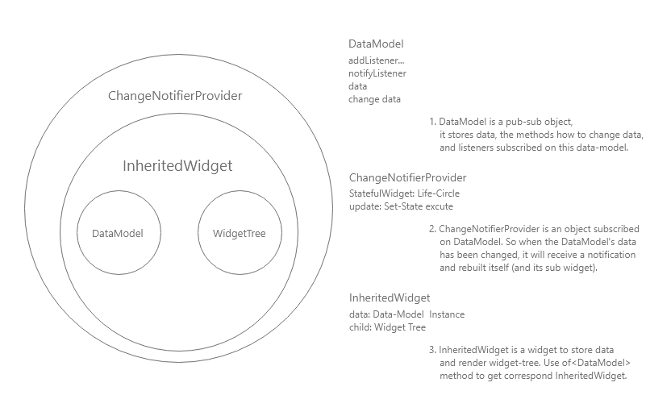

# Flutter Provider

- DataModel(ChangeNotifier)
- ChangeNotifierProvider
- Consumer
- Provider.of()
---

## 1. DataModel(ChangeNotifier)  
`ChangeNotifier` 是 `Flutter SDK` 中一个简单的类。该类是一个 `观察者模式` 的实现。
该类拥有 `addListener`, `removeListener`, `notifyListeners` 等三个重要的方法。  

- addListerner
  该方法 **将监听者添加到监听者列表**，对应在 App 中就是组件的更新方法。
- removeListener
  该方法 **将监听者从监听者列表中移除**，同上。
- notifyListeners
  该方法 **需要用户在修改数据模型的同时进行调用**，然后它会 **将所有监听者列表中组件的更新方法遍历调用一次**，从而 **促使所有监听数据模型的组件更新画面**。

下面是 `Demo` 中的例子：
```dart
class ArticlesModel extends ChangeNotifier {

  final HttpService http = HttpService();

  List<ArticleModel> articles = [];

  List<ArticleModel> staredArticles = [];

  void init() async {
    articles = await http.getArticles();
    staredArticles = articles
      .where((ArticleModel elem) => elem.isSelected)
      .toList();
    notifyListeners();
  }

  void toggleStar(ArticleModel article) {
    if (!article.isSelected) {
      article.isSelected = true;
      staredArticles.add(article);
    } else {
      article.isSelected = false;
      staredArticles.remove(article);
    }
    notifyListeners();
  }

}
```
1. 创建一个 `ArticlesModel`， 它继承自 `ChangeNotifier` 类。
2. 创建数据，比如在此例中，为 `articles` 和 `staredArticles`。
3. 创建方法，更新数据模型后，如果确定方法需要更新画面，在最后请调用 `notifyListeners()` 方法，促使画面更新。  


## 2. Provider(ChangeNotifierProvider)
`ChangeNotifierProvider` 是由 `Provider` 库提供的多种 `Provider` 中的一种，也是最常用的一种。  
它是一个容器，其中包含了暴露给下面所有子组件的 `数据模型（DataModel）`以及 `子组件` 本身，如图：  
  
说一下简单的实现原理（考虑性能问题，内部实现可能更加复杂）：  
1. `ChangeNotifierProvider` 是一个有状态组件，用来更新画面，因为类中存在一个 `update()` 方法（其中使用了 `setState()`），所以当 `DataModel` 作为 `Data` 传入该组件中时，此 `update()` 方法会被 `addListener()` 添加到 监听者列表中。
2. `InheritedWidget` 相当于锚点，该组件存在的意义在于让子组件找到 **相同类型数据模型** 的 `ChangeNotifierProvider`（考虑如果一条组件树上存在多个 `ChangeNotifierProvider`，那么 `InheritedWidget` 就是找到该树上 **相同类型数据模型** 的方法）。
3. 当组件内部 `调用更新数据模型（DataModel）` 的方法时，`notifyListeners() => update() => setState()` 将会按照顺序调用，最后重新渲染 `ChangeNotifierProvider` 以及 `其下的所有子组件`。
4. 当 `ChangeNotifierProvider` 被注销掉时，会调用该组件的 `dispose` 方法，同时也会调用 `DataModel` 的 `dispose()`;

下面是 Demo 中的例子：  
```dart
void main() {
  runApp(ChangeNotifierProvider(
    create: (context) => ArticlesModel(),
    child: MyApp(),
  ));
}
```

因为 `Demo` 的复杂度不是很高，所以 **选择性的放在了全局**。如果应用的复杂度很高，该组件的最佳实践应该是 **将其放在需要此共享数据模型的上一层，而不是全局或者最外层**（不然就会有改变一个非常底层的子组件，整个 `APP` 都跟着重新渲染的问题）。  

## 3. Consumer  
`Consumer` 是 `Provider` 将 `数据模型（DataModel）`对子组件开放的一个组件，该组件有一个必须传递的参数 `builder回调函数`，当调用 `notifyListeners()` 方法时，所有的 `builder` 方法都会调用。  
- builder(context, dataModel, child)
  * `context` 需要构建的组件的上下文，以此来找到离自己最近的相应类型的 `InheritedWidget` 上的 `DataModel`。
  * `dataModel` 本质其实是 `Provider<T>.of(context)`，暴露给子组件的 `数据模型<T>`。
  * 用于 **优化目的** 子组件树，该组件树 **只会渲染一次**，不会随着数据模型改变而改变，当有 **子组件树非常庞大** 的时候才会使用它（**真到这个时候先考虑是不是 Consumer 用错了地方**）。  

最佳实践跟 `ChangeNotifierProvider` 一样，都是放在`尽可能低`的地方。使用 `Consumer<T>` 请一定一定在后面指定 `<T>` 的数据模型，如果不指定，它是找不到 `DataModel` 的。  
下面是 `Demo` 中的实例：  
```dart
// articles_list.dart
Widget _buildBody(BuildContext context) {
  return Consumer<ArticlesModel>(
    builder: (context, articlesModel, child) {
      final articles = articlesModel.articles;
      return Container(
        child: ListView.separated(
          itemCount: articles.length,
          itemBuilder: (BuildContext context, int index) {
            return ArticleItem(
              articles[index],
              articlesModel.toggleStar
            );
          },
          separatorBuilder: (BuildContext context, int index) => Divider(
            height: 0.5,
            color: Colors.black26,
          )
        ),
      );
    },
  );
}

// article_item.dart
class ArticleItem extends StatelessWidget {

  final ArticleModel article;
  final Function action;
  ArticleItem(
    this.article,
    this.action
  );

  @override
  Widget build(BuildContext context) {
    return ListTile(
      title: Text('${ article.id }.${ article.articleName }'),
      subtitle: Text(article.author),
      trailing: InkWell(
        child: Icon(article.isSelected
          ? Icons.star
          : Icons.star_border,
          color: Colors.blue
        ),
        onTap: () {
          print(article.id);
          action(article);
        },
      ),
    );
  }

}
```

其中，`ArticleItem` 为了使用 `DataModel` 中的方法，将其作为参数传递了下去，可以在组件内部进行使用（**跟 js/ts 一样，函数是一等对象**）。  

## 4. Provider.of  
在 `Provider` 整个库中，`of` 方法 以及 `InheritedWidget` 才是整个库的灵魂所在。  
（`Provider` 库中使用的是 `InheritedProvider`，这是开发者们使用 `SingleChildStatelessWidget` 自己实现的一个组件，原理跟 `InheritedWidget` 差不多）。
- of 方法
  它是用来取得最近 `InheritedWidget` 中 `DataModel` 的关键。  
```dart
static T of<T>(BuildContext context, {bool listen = true}) {

  final inheritedElement = _inheritedElementOf<T>(context);

  if (listen) {
    context.dependOnInheritedElement(inheritedElement);
  }

  return inheritedElement.value;
}
```
1\. 首先，`_inheritedElementOf<T>()` 方法会去树组件祖先中去找 `存储了类型 T 的最近的 InheritedWidget`。  
2\. 然后调用 `context` 上的 `dependOnInheritedElement()` 方法 将当前组件跟此 `InheritedWidget组件` **添加了依赖关系**。  
3\. 如果 `InheritedWidget组件` 的数据模型发生变化，通过 `State对象` 的 `didChangeDependencies` 也会促使子组件渲染更新。  

- InheritedWidget(InheritedProvider)  
  提供了一个 `updateShouldNotify()` 方法，可以控制如何调用子孙节点的 `didChangeDependencies()`，如：
```dart
@override
bool updateShouldNotify(InheritedWidget old) {
  //如果返回true，则子树中依赖(build函数中有调用)本widget
  //的子widget的`state.didChangeDependencies`会被调用
  return old.data != data;
}
```

由上面 `of` 方法可以得知其还有个可选参数 `listen`，它的作用是在源码里一目了然：  
- 如果 `listen` 为 `true`，则会绑定子组件和 `InheritedWidget` 的依赖，所以 `InheritedWidget` 的数据更新，子组件也会更新。`Consumer` 组件就是以这种方式实现的，所以 `Consumer` 组件下包裹的子组件，都会重新渲染。
- 如果 `listen` 为 `false`，则不会注册依赖关系，只是单纯的返回数据而已。所以根据应用复杂度，**如果不需要更新的组件却需要数据模型中的数据或者方法时，请避免使用 Consumer**，而使用 `Provider.of(context, listen: false)`;


